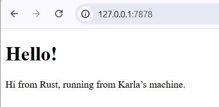
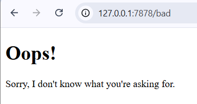
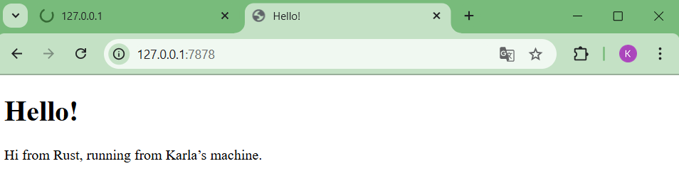

### Commit 1 Reflection Notes  
The `handle_connection` function processes incoming TCP connections by reading data from the `TcpStream`. A `BufReader` is used to efficiently read the stream line by line, since HTTP requests are text-based. The `.take_while(|line| !line.is_empty())` stops reading at the empty line that separates headers from the body, resulting in a vector of request lines containing the HTTP request structure.  

### Commit 2 Screen Capture  
 

### Commit 2 Reflection Notes  
The updated `handle_connection` function constructs a valid HTTP response by combining a status line, headers, and HTML content. The server reads the HTML file using `fs::read_to_string`, calculates its length, and formats the response accordingly.  

### Commit 3 Screen Capture  
  

### Commit 3 Reflection Notes  
The implementation now distinguishes between different HTTP requests by analyzing the request line and mapping it to specific responses. Using a tuple for status and filename helps decouple response configuration from content generation.  

### Commit 4 Screen Capture  

1. /sleep request (delayed)  
  

2. Normal request blocked  
  

### Commit 4 Reflection Notes  
By introducing a delay using `thread::sleep`, the server reveals that all requests are handled one at a time. While processing a slow request, other requests cannot be served, resulting in delayed responses.  

### Commit 5 Screen Capture

### Commit 5 Reflection Notes
The implementation of a ThreadPool improves the server by limiting the number of threads and reusing them to handle incoming requests. Instead of spawning a new thread for each connection, tasks are sent through a channel and executed by worker threads.